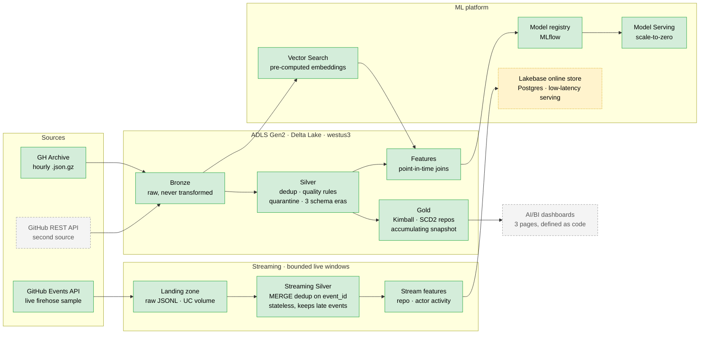

# Almanac

An **ML platform for work-queue risk**: work items arrive in a queue, some
breach their service expectation, and a model predicts which ones early
enough for a human to intervene.

Built on GitHub's public event firehose ([GH Archive](https://www.gharchive.org/))
because that dataset is real, large, free, genuinely messy, and carries a
real schema break — not because this project is about GitHub. The same
architecture serves a support-ticket queue, a claims backlog, or a fraud
review queue. The domain is incidental, and that is the point.

> **Status: Phase 0 (Exploration) complete — 9 of 9 tasks. Phase 1
> (Bronze + Silver) complete — 7 of 7, exit gate verified and merged.
> Phase 2 (Gold + the Azure burn) — 9 of 9 tasks, and the burn is done.
> Phase 3 (offline feature platform) — 8 of 8 tasks. Phase 4 (model +
> MLflow) — 13 of 13 tasks: a measured regression null result, reframed to
> classification (§5.3), a real non-null result registered live in Unity
> Catalog, and a live serving endpoint with measured warm latency and a
> measured cold start (51.96 s). Phase 5 (semantic layer + vector search)
> complete. Phase 6 (streaming ingest + online feature store) — 10 of 10
> tasks, exit gate demonstrated against the live GitHub feed and the
> billable stack torn down.**
> **The full medallion has run on a real quarter of the firehose:**
> Q3 2025, 92 of 92 days, 2,208 hourly files, **341,060,851 rows**,
> 165.987 GB gz, **zero missing hours**, for **$11.96** — 38% of the
> estimate and 6.5% of the credit. Gold then built over that quarter for
> **$0.78**, 23 of 23 dbt nodes green, including point-in-time
> correctness, row conservation and referential integrity to `dim_repo`
> **at 341M-row scale** rather than on fixtures. Measured throughput is
> published per layer — **32.89 GB gz per billed cluster-hour** for
> Bronze + Silver together, **2.4x better** than Phase 1's Bronze-only
> calibration, which resolved a pre-registered risk in the opposite
> direction to the one it was written for.
> **Bronze → Silver runs end to end** on both committed fixtures — era
> normalization, cross-hour dedup, null-safe quality rules and a
> conserving quarantine split — alongside the ingestion edge, local Spark
> + Delta, CI, cloud infrastructure and the declarative source contract
> (242 tests). **Gold's Kimball layer:** `dim_repo` (SCD2 on repo identity — a rename closes the old
> row and opens exactly one current row, case-only renames detected, a
> double rename yields three versions); `fact_pull_request`, an
> event-native accumulating snapshot carrying the **§5.1 label** —
> `time_to_first_response_seconds`, the first response from someone other
> than the PR author, with every PR either labelled or carrying a stated
> reason it is not (draft, right-censored, author unobserved); and
> `agg_repo_daily`, the daily activity mart — "stars gained" not a running
> total, commit volume from `payload.size` not the 20-capped array. Every
> fact column comes from the event stream, never the `payload.pull_request`
> object October 2025 gutted; the two consumer models carry **enforced
> column contracts** and a `relationships` check to `dim_repo`, both proven
> to fail the build by a break-it test. All three verified against real
> multi-run lifecycles, not one build. The **GitHub REST API second
> source** is built and tested (never against the live network) — and
> §4.5a's "a new source onboards via YAML alone, zero new Python" claim is
> **falsified and the failure accounted for**: a file mirror would pass it,
> a paginated, authenticated, rate-limited API took ~120 lines of Python.
> The **Photon A/B** ran three replicate pairs and is published including
> the part that did not come out: Silver **2.14x** and Gold **1.38x**, and
> Bronze **withheld as indeterminate** — re-running an identical arm varies
> by up to 30% here, which is larger than the ~15% effect being tested, so
> a single run produced opposite verdicts on two occasions. The harness was
> fixed to refuse the question rather than answer it. The decision it
> informs is **do not enable Photon**: break-even on its DBU multiplier
> lands at 1.55–2.16 against a multiplier of roughly 2x, so it is a wash,
> and the real lever is Bronze's single-threaded gzip at 64% of execution.
> **Phase 3 built the offline feature platform, still no model.** Three
> v1 feature groups — `author_activity`, `repo_activity`, `pr_static` —
> computed Silver-native (never a read of `fact_pull_request` or
> `agg_repo_daily`, per §3.1's peer-of-Gold rule), joined onto a spine via
> a hand-rolled point-in-time `as_of_join` rather than Databricks Feature
> Engineering or Feast. Every table also gets a Unity Catalog
> `TIMESERIES` primary key via plain DDL for governance/lineage only —
> the join itself stays hand-owned. The centerpiece invariant is tested
> directly, not just inferred from the join's own boundary test: pinning
> a Delta version reproduces a feature vector byte-for-byte after a
> later, point-in-time-valid append changes the live answer. Online
> store and vector index stay deferred to Phase 4/5 on purpose. **Live UC
> registration against a real Databricks target is still unverified** —
> the SQL is unit-tested, execution is deferred to Phase 3's cloud
> verification step.
> **Phase 4 trained a model and measured it against a baseline for real,
> on the real quarter.** The first attempt — LightGBM regression on the
> ten v1 features, predicting time-to-first-response directly — scored
> `model_mae` **108,890 s** against a naive median-per-segment
> `baseline_mae` **71,917 s**: worse, not better, a genuine null result
> driven by the trainable population's severely right-skewed response
> time (median 72 s, mean 20 h, max 92 days), which a default
> squared-error objective handles poorly. §5.1's own gate — no model
> registers, no endpoint deploys, unless it measurably beats the
> baseline — held and did exactly what it exists to do; the result is
> recorded, not quietly patched into a different number
> (`docs/findings/2026-09-04-model-serving-measured.md`).
> **Reframed to classification (§5.3)** — predict SLA breach/no-breach
> against the measured p75 threshold (1,487 s) instead of the raw
> duration — and re-measured for real on the same quarter:
> `LGBMClassifier` beat a per-segment breach-rate baseline by more than
> 2x on PR-AUC (**0.612 vs. 0.285**, `roc_auc` 0.828), across a real
> comparison sweep of two hyperparameter configs rather than one shot.
> The gate fired for real this time and registered the winner in Unity
> Catalog (`almanac_dbx.models.pr_review_sla_risk` v1, `@champion`
> alias) — the **first live UC registration in this project** — which
> surfaced a real defect no local test had caught: `mlflow.lightgbm.
> log_model` was never called with a `signature`, invisible against a
> `file://` MLflow store but fatal against UC's registry; fixed and
> closed with a local regression test asserting every logged model
> carries one, so a future run can't hit it blind
> (`docs/findings/2026-09-04-classification-model-serving-measured.md`).
> **The serving endpoint is live and fully measured, cold start
> included.** `databricks_model_serving.pr_review_sla_risk` reached
> `READY` in 8m27s; 20 real invocations against the model's actual
> signature measured **warm latency p50 263.5 ms, p95 376.8 ms**. After
> a genuine ~43-minute idle gap — confirmed live that Databricks scales
> to zero at 30 minutes, not assumed — one real request measured
> **cold start at 51.96 s**, with three immediate follow-ups back to
> sub-second confirming it wasn't a fluke
> (`docs/findings/2026-09-04-serving-endpoint-measured.md`). Real-scale
> running of the feature platform also surfaced and fixed the same
> O(N²) bot-author join blow-up in two places (`compute_author_activity`'s
> self-join, and `as_of_join` itself, the feature platform's own core
> primitive — 11.7 PiB of intermediate on one join at real scale) and a
> local-vs-cloud divergence in where dbt materialises Gold.
> Planning Phase 2 found **two defects in that committed, CI-green Phase
> 1 code** — Silver overwrote its whole table on every file, and read the
> raw archive rather than Bronze. Both were invisible at a sample size of
> one file, which is all Silver had been run against. **Both are now
> fixed** (Phase 2 Task 1), and recorded rather than quietly repaired,
> because the interesting part is *why the tests passed*. Task 2 hit the
> same shape a third time: with an ephemeral metastore, dbt rebuilds every
> model from scratch and still reports success. It was **reproduced
> deliberately before being fixed** — two consecutive runs, two
> `CREATE OR REPLACE` commits, no `MERGE`, correct row counts throughout.
> Task 3 found a fourth: a relative `--silver-path` resolved against the
> wrong directory on a non-`default` schema, registering a metastore
> table that pointed at nothing Silver ever wrote — caught because the
> registration was exercised against real data rather than trusted from
> the DDL reading correctly.
> **Phase 5 shipped the semantic layer and vector search**; see
> [`docs/STATUS.md`](docs/STATUS.md) for its task-level record.
> **Phase 6 made the platform live.** A poller reads GitHub's public
> Events API on its advertised interval, lands raw JSONL, and a
> Structured Streaming job builds streaming Silver and two online feature
> tables that are published to a **Lakebase** online store and served from
> Postgres. The exit gate was demonstrated end to end rather than
> asserted: across two live windows, **84 repos had their served feature
> values change**, 684 were added and none lost — one repo went from
> `events_prior_24h=11` to `18` because of events polled 25 minutes after
> the first value was read out of Lakebase. Offline↔online consistency was
> checked against the raw feed rather than the pipeline's own account of
> itself: **4,925/4,925 repos and 3,721/3,721 actors**, zero duplicates in
> 6,801 events. **Freshness is reported decomposed**, because most of it
> is not ours: end-to-end p50 **561 s**, of which GitHub's own feed delay
> is **302 s (54%)** and only **121 s** is pipeline work. Live capture is
> **8.5–8.9%** of the archive's 155–162K events/hour — the public feed is
> a sample, not a firehose.
> **The live window falsified four things this repo had written down**,
> which is the more useful result: the feed is not REDUCED_V3-only (a 2021
> event arrived mid-window); `publish_table` does not create its catalog,
> which must be a *standard* catalog and needs its schema pre-created; and
> `dropDuplicatesWithinWatermark` handled late events by **discarding**
> them, costing 161 repos in the run whose checkpoint had a watermark to
> restore. That last one is fixed — dedup moved to an insert-only Delta
> `MERGE` on `event_id`, leaving the stream stateless — and the others are
> corrected in place with the runs that disproved them.
> The ephemeral Lakebase stack was **torn down** at a measured idle rate of
> **0.852 DBU/hour — $12.06/day** — read the day after, since
> `system.billing.usage` lags and cannot be queried during the window it
> measures. The whole experiment cost $3.69 in DBUs, and a stopped instance
> was confirmed to bill **nothing**, not merely less.
> [`docs/STATUS.md`](docs/STATUS.md) is the authoritative record, updated
> in the same commit as the work it describes.

**No number in this README is quoted unless it was measured.** Where
something is still unknown, it says so.

## The centerpiece

**Point-in-time correctness.** Every feature computed for a work item at
time T uses only events with `created_at < T`. This is where label
leakage lives — invisible in code review, impossible to bluff, and the
cleanest separator between shipped ML systems and notebook models.

## Architecture, at a glance



Solid green = built and green. Dashed grey = designed, not built.
Dashed amber = built and demonstrated live, then **torn down on purpose** —
a Lakebase online store bills for existing, so it runs for a measured window
and is destroyed with its stack.

## What has been measured

Phase 0 existed to replace assumption with measurement. Several findings
**changed the design before code was written against the old one** —
which is the entire point of doing it first:

| Finding | Measurement | Consequence |
|---|---|---|
| **A third schema era, undocumented anywhere** | Bisected one hour per date, 2025-01 → 2026-08 | Between **2025-10-08 and 2025-10-15**, `payload.pull_request` was cut from **48 fields to 5**. Post-Oct-2025 data structurally cannot support the label. Window moved to Q3 2025; facts rebuilt from the event stream rather than embedded payloads |
| **The label was undefined for most of the population** | Full parse of one real hour (227,376 events) | Formal review reaches only **~1 PR in 4**. Redefined to *time to first human response*, later validated at **1.84× coverage** (6,533 of 6,618 PRs) |
| **Legacy events have no `id`** | 2,000 events per era | 0 of 2,000. The `event_id` dedup key the design rested on does not exist pre-2015 → content-hash surrogate |
| **Legacy timestamps are not UTC** | Same diff | Pre-2015 `created_at` carries `-07:00`. A naive parse shifts every legacy timestamp seven hours, silently, past every schema check |
| **The bot heuristic was wrong** | 1,002 distinct matching logins | **869 (86.7%) were human surnames.** Volume-ranked inspection had shown 100% true positives — structurally blind, since bots are high-volume by definition |
| **SCD2 is warranted** | 1,071,901 repos across Q3 2025 | **3,792** renames against a gate of 50. Case-only renames exist, so comparison must be case-sensitive |
| **Availability, not quota, picks the region** | `az vm list-skus --all`, 4 regions | Every Databricks node type is `NotAvailableForSubscription` in `eastus2`/`eastus`, all zones. Deployed to **`westus3`** |
| **Cluster throughput, measured not estimated** | One day (2025-08-13) on 4 × `D4ds_v6` + driver, DBR 17.3 LTS | **13.84 GB gz per *billed* cluster-hour** — 3.79M rows, $0.34/day-of-data. Timing compute and network separately mattered: the Spark-only rate is 36.72 and a single wall-clock timer would have understated the bill by a third |
| **The recorded cluster cost was 25% low** | Azure Retail Prices API, `westus3` | `num_workers: 4` provisions **five** VMs — four workers and a driver. The recorded $1.896/hr counted workers only; it is $2.370/hr |
| **One archive file's events span two UTC hours** | Committed legacy fixture, 2,000 events | A file named hour 14 holds events from 14:05 to 15:01 at `-07:00` — **1,957 in UTC hour 21, 43 in hour 22**. So Silver partitions by *ingest* (the file) and reasons by *event time* (`created_at`); deriving the partition from `created_at` would scatter one file across two of them and break idempotent replacement |
| **The PR-comment discriminator does not exist before 2015** | 2,000 events per era | `issue.pull_request` is present on 55 of 92 modern `IssueCommentEvent` and **0 of 194 legacy** ones. Reported as null, not false — a fabricated negative would silently drop the whole legacy era from the label, which already has no `PullRequestReviewEvent` there |

Full write-ups in [`docs/findings/`](docs/findings/), each carrying its
method and its sample size.

**That unknown is now closed.** Cluster throughput was the last unmeasured
input, and every cost figure in the design depended on it — so Tier 3's
span was derived from a calibration run rather than chosen up front. It
came out at **13.84 GB gz per billed cluster-hour**, which made the full
Q3 2025 quarter affordable at 17.2% of the credit. The rule was written to
bind in both directions; it bound upward, from one month to a quarter.

## Stack

| Layer | Choice |
|---|---|
| Processing | PySpark 4.2.0, Delta Lake 4.4.0 |
| Transform (Gold only) | dbt-core 1.12.3 + dbt-spark 1.11.0, `session` and `databricks` targets |
| Cloud | Azure Databricks (Premium, Unity Catalog), ADLS Gen2, `westus3` |
| Infrastructure | Terraform |
| Language | Python 3.12 — `uv`, Pydantic v2, `ruff`, `mypy --strict`, `pytest` |
| CI | GitHub Actions — lint, format, types, tests on every push |
| Reporting | Databricks AI/BI — 3 dashboards, JSON committed and Terraform-managed |

Stack choices, and what each substitution costs, are argued in the design
doc rather than asserted here.

## Layout

```text
src/almanac/        extract · explore · pipeline · gold · features · model · embed · stream
                    contracts (governed surfaces) · governance (lineage) · infra (the cloud window)
dbt/                the Gold project — models, snapshots, sources, both targets
tests/              unit tests + committed fixtures; tests never touch the network
docs/design/        the authoritative architecture and phasing document
docs/findings/      measurements, each with its method and sample size
docs/plans/         per-phase implementation plans, written before any code
docs/lineage/       column lineage, generated from Unity Catalog by `make lineage`
docs/data-contract.md   what a consumer may rely on, every number citing its finding
infra/terraform/    Azure resource group, ADLS Gen2, Databricks workspace, the jobs, the reporting warehouse
docker/             containerized Spark + Delta, matching CI
```

## Running it

```bash
uv sync --all-extras --dev
make check      # ruff + mypy --strict + pytest
make test-all   # includes Spark tests
make dbt        # fixtures -> Silver, then the Gold layer through the runner that builds the session first
make fixtures   # rebuild committed fixtures from the live archive
```

The cloud side is brought up and taken down by one command each, and both
refuse any plan that reaches past the window they were asked for:

```bash
make window-up      # the reporting SQL warehouse, and nothing else
make window-down    # gone, confirmed from state rather than from an exit code
```

Tests run offline against committed fixtures. Anything touching the
network is marked and excluded from the default run.

## Design

[`docs/design/2026-09-01-almanac-system-design.md`](docs/design/2026-09-01-almanac-system-design.md)
is the authoritative architecture, phasing, and scope document.

## Why the name

An almanac is a book of tables indexed by date — you look up what was true
on a given day — *and* a book of forecasts. Those are the two pillars of
this system: point-in-time historical lookup, and prediction.

---

*Data: [GH Archive](https://www.gharchive.org/) by Ilya Grigorik, ODC-By v1.0.*
