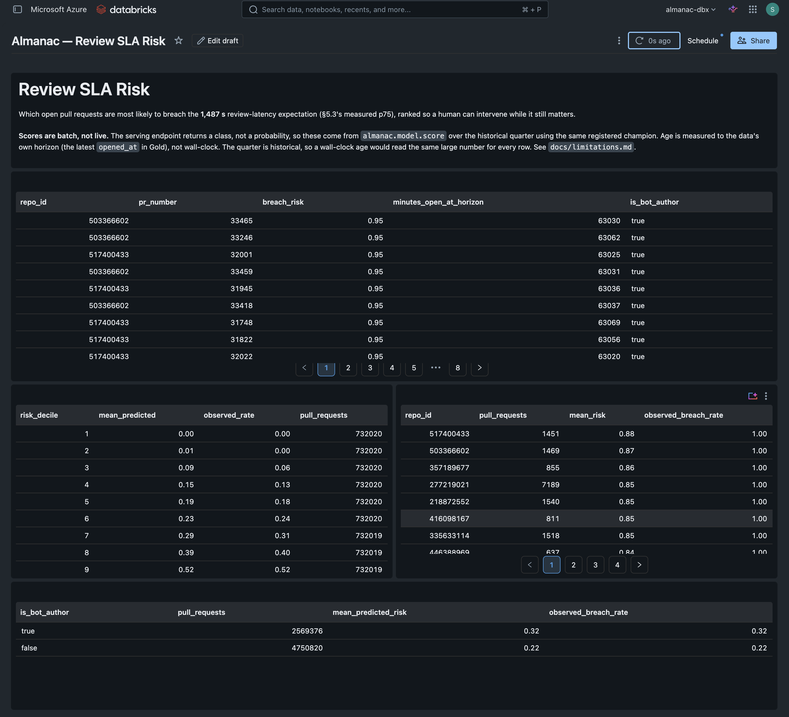
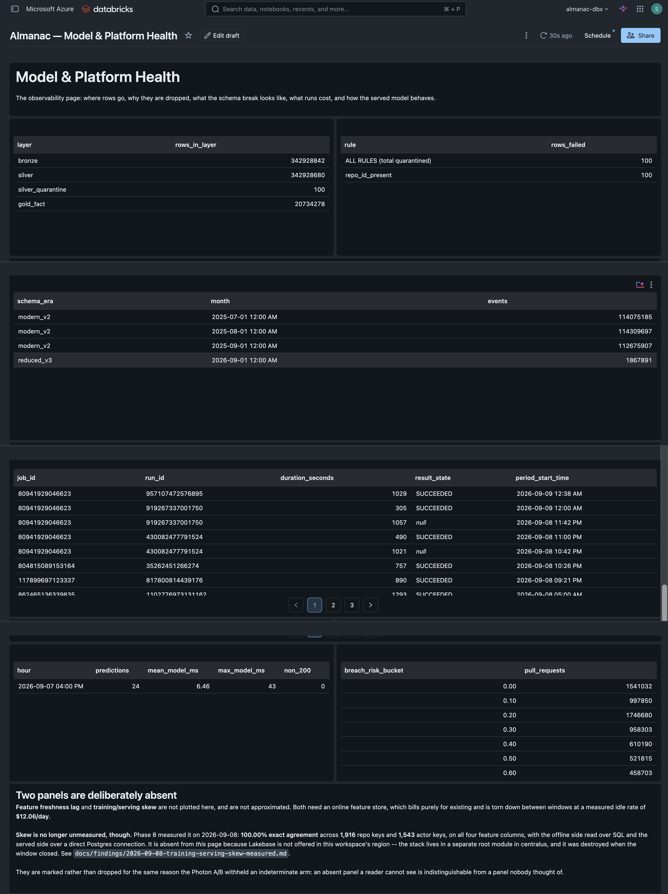
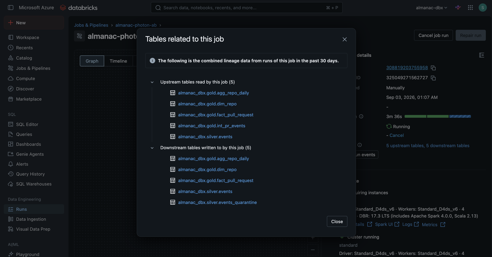
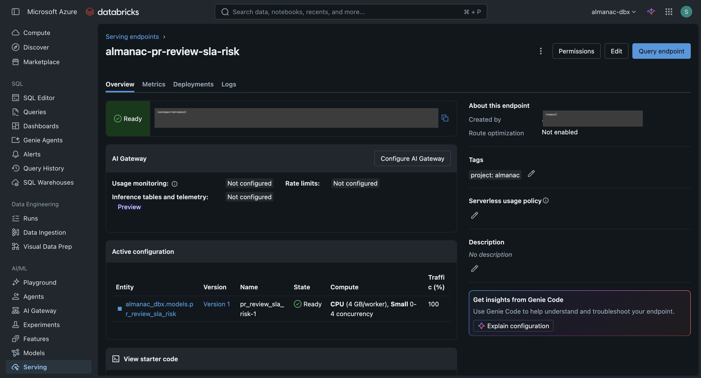
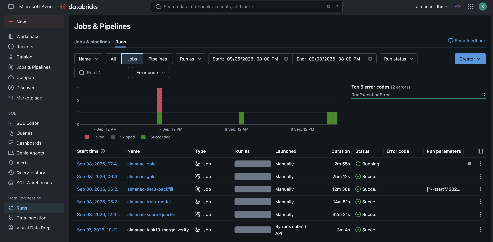
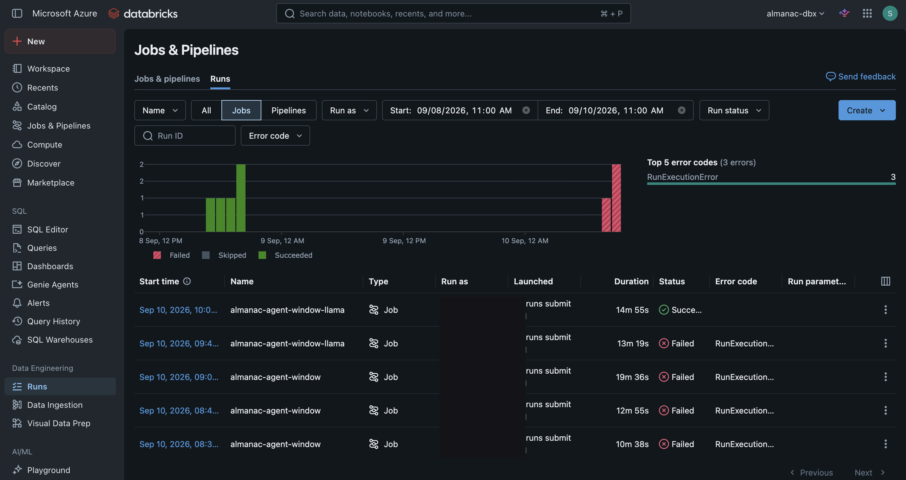
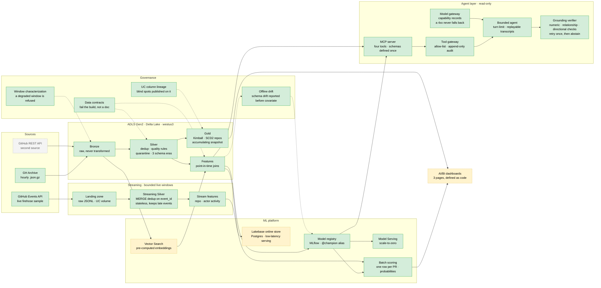

# Almanac

[](https://github.com/bsreecharanreddy/almanac/actions/workflows/ci.yml)
[](https://codecov.io/gh/bsreecharanreddy/almanac)


An **ML platform for work-queue risk**: work items arrive in a queue, some
breach their service expectation, and a model predicts which ones early
enough for a human to intervene.

Built on GitHub's public event firehose ([GH Archive](https://www.gharchive.org/))
because that dataset is real, large, free, genuinely messy, and carries a
real schema break — not because this project is about GitHub. The same
architecture serves a support-ticket queue, a claims backlog, or a fraud
review queue. The domain is incidental, and that is the point.

---

## In sixty seconds

**Built solo, start to finish** — design docs, infrastructure, pipelines,
model, serving, dashboards, and the write-ups of what went wrong.

**341,060,851 real events** ingested across a real schema break, for a
**measured $11.96**. A point-in-time-correct feature store, a model
measured at **0.4661 PR-AUC** against a 0.2650 baseline, a live serving
endpoint with **measured cold start (51.96 s)** and warm **p50 263.5 ms**,
and three AI/BI dashboards demonstrated against the real quarter.

**88% coverage** on transformation and feature logic, gated at 85% in CI.
**Clone to a green run: 4 m 28 s**, measured on a cold cache.

Three decisions that carry the project:

- **Point-in-time correctness is enforced, not asserted.** Every feature
  computed `as_of` T reads only events with `created_at < T`, and the
  invariant is stated so it can be tested: the same `as_of` must produce a
  byte-identical vector from the same Delta version, a year later.
- **A baseline shipped before the model, and the first result was a null
  one.** LightGBM lost to a per-segment median by 51% on the regression
  target. That is published, not buried — then reframed to classification,
  where it wins by a measured margin.
- **The project found a leakage bug in its own registered champion.**
  The train/test split was random where the design requires temporal.
  Fixed, re-scored, and the inflated number retracted in public: **0.612 →
  0.4661**, optimistic by 24%. The leakage suite was green throughout and
  was not wrong — it tested one axis, and the bug was on another.

**No persistent public demo.** The serving endpoint scales to zero and
needs Databricks auth; everything billable is torn down between sessions
on purpose, and the cost of each teardown is measured. The evidence below
is the artifact, and `make check-fast` reproduces the local half in
4 m 28 s from a fresh clone.

### What it looks like

| | |
|---|---|
|  |  |
| **Page 1 — the intervention queue**, ranked by predicted breach risk, with a calibration curve monotonic across all ten deciles. | **Page 2 — model and platform health**: both schema eras side by side, the quarantine panel firing for the first time in 341M+ rows, and the two panels that ship *marked unavailable* rather than faked. |
|  |  |
| **Column-level lineage** across the medallion, published with the edges the catalog cannot see stated on it. | **The serving endpoint**, live, with measured warm and cold latency. |



**The run history, failures included.** Two `RunExecutionError`s sit in the
same view as the successes, because a portfolio that only shows green is
not evidence of anything. The `["--start","202…"]` parameters on the
backfill row are the demo window being run against a chosen date rather
than a hardcoded one. *(The `Run as` column is redacted — it carried a
real name.)*



**The agent layer's own run history: five runs to get one answer.** Four
failed, each for a different reason — a dependency the wheel didn't
carry, a host that already owned an event loop, a vendor rate limit, a
storage layer that doesn't support append — before a substitute model
answered on the fifth. Full account:
[`docs/findings/2026-09-10-agent-layer-window.md`](docs/findings/2026-09-10-agent-layer-window.md).
*(Same redaction as above.)*

---

> **Status: `v1.0` tagged, all nine phases merged.** Two more are merged
> on top, untagged: Phase 9, an agent layer (PR #20), and Phase 10, a
> deterministic grounding verifier on its answers (PR #21). Both are
> additive and read-only — everything below this line still describes
> `v1.0` and remains true of it. The Phase 9 window's cost is read
> (**$5.59** in DBUs), so `v1.1.0` tags both phases together next. Phase
> by phase, each led by
> what it *found*: [`CHANGELOG.md`](CHANGELOG.md). Task granularity and
> the verification log: [`docs/STATUS.md`](docs/STATUS.md).


**No number in this README is quoted unless it was measured.** Where
something is still unknown, it says so.

## Why this project

**The problem, and the motivation.** Almost every operational system is a
work queue with a clock on it — pull requests waiting on review, tickets
waiting on a response, claims waiting on adjudication. The expensive
failure mode is always the same: finding out *after* the breach, when
nobody could have acted on it. This is built on GitHub's public event
firehose because it's a real, public, honest stand-in for that whole
class of problem — real, large, free, genuinely messy, and carrying an
actual schema break — not because pull requests themselves are what's
being predicted. **The domain is deliberately incidental**: nothing in
the platform layer knows the items are pull requests, so the same
architecture serves a support-ticket queue or a claims backlog. One
invariant sits under all of it — [point-in-time correctness](#the-centerpiece)
— because a feature that can see its own future is invisible in code
review and impossible to bluff.

**What this is for.** A reader can:

- clone it and get a green run in **4 m 28 s** on a cold cache;
- read the medallion over the real 341,060,851-row GH Archive quarter,
  Bronze never transforming, Silver parsing and quarantining, Gold and a
  point-in-time feature platform reading Silver as peers rather than a
  chain;
- see a served model with a measured baseline (**0.4661 PR-AUC vs 0.2650**)
  rather than an accepted-on-faith number;
- and, on top of that, ask an agent a breach-risk question and get an
  answer where every number traces to a tool call and is mechanically
  checked against it — not merely trusted because the model said so.

**Key takeaways, and what's next.** A green test suite is necessary and
not sufficient — this project hit that wall at three separate layers: a
leakage bug a leakage suite couldn't see because it tested row time and
the bug was on split time; four defects (a silently dropped merge type, a
serving endpoint live on a retracted model, a dashboard aged 340 days
wrong, a quarantine path firing for the first time in 341M+ rows) that
only existed at real volume, through the full stack, inside a paid
window; and an agent's own false claim under a green "every number came
from a tool" rule. Each was found by measuring, not by trusting a passing
suite. Deliberately not done, and named rather than hidden: an LLM-judge
cross-check as a second opinion on top of the deterministic gate, a
larger relationship table for the grounding verifier, a real serving path
for the agent rather than the offline windows it runs in today, and the
two dashboard panels Phase 7 deferred rather than shipped half-checked.

## The centerpiece

**Point-in-time correctness.** Every feature computed for a work item at
time T uses only events with `created_at < T`. This is where label
leakage lives — invisible in code review, impossible to bluff, and the
cleanest separator between shipped ML systems and notebook models.

## Architecture, at a glance



Solid green = built and green. Dashed grey = designed, not built.
Dashed amber = built and demonstrated live, then **torn down on purpose**.
A Vector Search endpoint and a Lakebase online store both bill for merely
existing ($6.72/day and $12.06/day, measured), and a SQL warehouse bills
while a dashboard is being looked at — so each ran for a measured window and
was destroyed with its stack. **The Delta tables they were built over
survive**; only the serving copies are gone. Model Serving stays up because
it is the one that genuinely scales to zero: measured DBUs during its live
window, then zero.

## What has been measured

Phase 0 existed to replace assumption with measurement. Several findings
**changed the design before code was written against the old one** —
which is the entire point of doing it first:

| Finding | Measurement | Consequence |
|---|---|---|
| **A third schema era, undocumented anywhere** | Bisected one hour per date, 2025-01 → 2026-08 | Between **2025-10-08 and 2025-10-15**, `payload.pull_request` was cut from **48 fields to 5**. Post-Oct-2025 data structurally cannot support the label. Window moved to Q3 2025; facts rebuilt from the event stream rather than embedded payloads |
| **The label was undefined for most of the population** | Full parse of one real hour (227,376 events) | Formal review reaches only **~1 PR in 4**. Redefined to *time to first human response*, later validated at **1.84× coverage** (6,533 of 6,618 PRs) |
| **Legacy events have no `id`** | 2,000 events per era | 0 of 2,000. The `event_id` dedup key the design rested on does not exist pre-2015 → content-hash surrogate |
| **Legacy timestamps are not UTC** | Same diff | Pre-2015 `created_at` carries `-07:00`. A naive parse shifts every legacy timestamp seven hours, silently, past every schema check |
| **The bot heuristic was wrong** | 1,002 distinct matching logins | **869 (86.7%) were human surnames.** Volume-ranked inspection had shown 100% true positives — structurally blind, since bots are high-volume by definition |
| **SCD2 is warranted** | 1,071,901 repos across Q3 2025 | **3,792** renames against a gate of 50. Case-only renames exist, so comparison must be case-sensitive |
| **Availability, not quota, picks the region** | `az vm list-skus --all`, 4 regions | Every Databricks node type is `NotAvailableForSubscription` in `eastus2`/`eastus`, all zones. Deployed to **`westus3`** |
| **Cluster throughput, measured not estimated** | One day (2025-08-13) on 4 × `D4ds_v6` + driver, DBR 17.3 LTS | **13.84 GB gz per *billed* cluster-hour** — 3.79M rows, $0.34/day-of-data. Timing compute and network separately mattered: the Spark-only rate is 36.72 and a single wall-clock timer would have understated the bill by a third |
| **The recorded cluster cost was 25% low** | Azure Retail Prices API, `westus3` | `num_workers: 4` provisions **five** VMs — four workers and a driver. The recorded $1.896/hr counted workers only; it is $2.370/hr |
| **One archive file's events span two UTC hours** | Committed legacy fixture, 2,000 events | A file named hour 14 holds events from 14:05 to 15:01 at `-07:00` — **1,957 in UTC hour 21, 43 in hour 22**. So Silver partitions by *ingest* (the file) and reasons by *event time* (`created_at`); deriving the partition from `created_at` would scatter one file across two of them and break idempotent replacement |
| **The PR-comment discriminator does not exist before 2015** | 2,000 events per era | `issue.pull_request` is present on 55 of 92 modern `IssueCommentEvent` and **0 of 194 legacy** ones. Reported as null, not false — a fabricated negative would silently drop the whole legacy era from the label, which already has no `PullRequestReviewEvent` there |

Full write-ups in [`docs/findings/`](docs/findings/), each carrying its
method and its sample size.

**That unknown is now closed.** Cluster throughput was the last unmeasured
input, and every cost figure in the design depended on it — so Tier 3's
span was derived from a calibration run rather than chosen up front. It
came out at **13.84 GB gz per billed cluster-hour**, which made the full
Q3 2025 quarter affordable at 17.2% of the credit. The rule was written to
bind in both directions; it bound upward, from one month to a quarter.

**The agent layer's paid window (Phase 9, not part of `v1.0`) measured
something similar for foundation models.** Neither configured endpoint
could serve the agent in this workspace — every Claude endpoint returns
403 for a Databricks-set rate limit of 0 while reporting `READY`, and the
configured fallback's replies don't parse — so `READY` is not the same
claim as callable, and only a real request reveals the difference. A
substitute model answered instead, and its one live answer put every
number through a tool call and still misstated what one of them meant.
Full write-up: [`docs/findings/2026-09-10-agent-layer-window.md`](docs/findings/2026-09-10-agent-layer-window.md).

**Phase 10 closes that gap with a deterministic verifier, not a second
model.** The false claim above put a real, tool-sourced number ("Delta
version 92") into the wrong relationship ("trained on" instead of "read
as of") — every number was real and the claim about it still wasn't. The
verifier checks three things separately: every numeric literal traces to
a tool-returned field under a stated rounding rule, every typed claim
(trained-on, read-as-of, model-version, score, baseline) traces to the
*specific* field that type means rather than just some real number
nearby, and a raises/lowers-risk claim agrees with the actual sign of the
feature contribution it names. A failed check gets the model one retry
with its own failure rows attached; still fails, the run returns a typed
`Ungrounded` result instead of the number. It runs offline — regex and
structural traversal over the run's own transcript, no model call — so it
is a normal `pytest` step in `make check`, not a new CI job, and a golden
set of known-good and known-bad transcripts fails the build today on the
same false claim that motivated it.

## What it does not do

Stated here rather than left for a reader to discover. The full list, with
upgrade paths, is [`docs/limitations.md`](docs/limitations.md).

- **Streaming stops at Silver.** The live path feeds the online feature
  store, not Gold. Gold is filled from the archive, which is the complete
  source; the streaming path exists to prove streaming semantics, not to
  be the only writer.
- **`is_draft` is unavailable in the reduced era**, so it is reported as
  unknown rather than `False`. Recovering it needs a REST enrichment that
  would read current state into a point-in-time feature — deferred for
  leakage reasons, not effort.
- **A recent window can be scored but not trained on.** The schema break
  that makes the drift story also breaks the label, and labels need ~21 h
  to resolve. The model is trained on Q3 2025 and scored forward.
- **The live feed captures ~7% of real event volume** — a politeness
  interval honoured deliberately, which is why the correctness proof for
  exactly-once lives in a replay harness rather than in the feed.

## Stack

| Layer | Choice |
|---|---|
| Processing | PySpark 4.2.0, Delta Lake 4.4.0 |
| Transform (Gold only) | dbt-core 1.12.3 + dbt-spark 1.11.0, `session` and `databricks` targets |
| Cloud | Azure Databricks (Premium, Unity Catalog), ADLS Gen2, `westus3` |
| Infrastructure | Terraform |
| Language | Python 3.12 — `uv`, Pydantic v2, `ruff`, `mypy --strict`, `pytest` |
| CI | GitHub Actions — lint, format, types, tests on every push |
| Reporting | Databricks AI/BI — 3 dashboards, JSON committed and Terraform-managed |

Stack choices, and what each substitution costs, are argued in the design
doc rather than asserted here.

## Layout

```text
src/almanac/        extract · explore · pipeline · gold · features · model · embed · stream
                    contracts (governed surfaces) · governance (lineage) · infra (the cloud window)
dbt/                the Gold project — models, snapshots, sources, both targets
tests/              unit tests + committed fixtures; tests never touch the network
docs/design/        the authoritative architecture and phasing document
docs/findings/      measurements, each with its method and sample size
docs/plans/         per-phase implementation plans, written before any code
docs/lineage/       column lineage, generated from Unity Catalog by `make lineage`
docs/data-contract.md   what a consumer may rely on, every number citing its finding
docs/pseudonymization.md  what is masked in published artifacts, and what the check cannot see
dashboards/         §7's three AI/BI pages as committed JSON, provisioned by Terraform
infra/terraform/    Azure resource group, ADLS Gen2, Databricks workspace, the jobs, the reporting warehouse
docker/             containerized Spark + Delta, matching CI
```

## Running it

```bash
uv sync --all-extras --dev
make check-fast   # ruff + mypy --strict + the 340 tests that need no SparkSession
```

**Clone to a green run is 4 m 28 s, measured** on a fresh clone with a
cold `uv` cache — 1 s to clone, 75 s to sync, 192 s for `check-fast`.
Re-measured 2026-09-09 at **80 s** with the cache warm. Both are against a
15-minute gate; the cold number is the one worth quoting.

Then, when you want the whole thing:

```bash
make check      # the full gate: adds the Spark suite. 33 m 27 s measured, so not the inner loop
make test-all   # every test including the network-marked ones
make dbt        # fixtures -> Silver, then Gold through the runner that builds the session first
make fixtures   # rebuild committed fixtures from the live archive
```

The cloud side is brought up and taken down by one command each, and both
refuse any plan that reaches past the window they were asked for:

```bash
make window-up      # the reporting SQL warehouse, and nothing else
make window-down    # gone, confirmed from state rather than from an exit code
```

Tests run offline against committed fixtures. Anything touching the
network is marked and excluded from the default run.

## Design and the paper trail

[`docs/design/2026-09-01-almanac-system-design.md`](docs/design/2026-09-01-almanac-system-design.md)
is the authoritative architecture, phasing, and scope document.

| | |
|---|---|
| [`CHANGELOG.md`](CHANGELOG.md) | phase-by-phase history, including what turned out wrong |
| [`docs/STATUS.md`](docs/STATUS.md) | the verification log, at task granularity |
| [`docs/limitations.md`](docs/limitations.md) | what this does **not** do, written before anyone had to find out |
| [`docs/decision-memo.md`](docs/decision-memo.md) | ship / don't-ship, with a stated confidence level and a prediction that was later scored |
| [`docs/adr/`](docs/adr/) | eight decisions, each citing the measurement that settled it |
| [`docs/goal-reconciliation.md`](docs/goal-reconciliation.md) | every stated goal checked against the artifact that would prove it |
| [`docs/findings/`](docs/findings/) | the measurements themselves, each with its `n` and its method |
| [`docs/postmortem-watermark-data-loss.md`](docs/postmortem-watermark-data-loss.md) | one real incident, written up properly |

## Who should look at what

- **ML platform / MLOps** — the feature platform (`src/almanac/features/`)
  and its leakage suite, then
  [`2026-09-08-champion-rescored-temporal-split.md`](docs/findings/2026-09-08-champion-rescored-temporal-split.md):
  a leakage bug found in this project's own registered champion, and the
  published number retracted because of it.
- **Data engineering** — `src/almanac/pipeline/` for the medallion and the
  three schema eras, `dbt/` for Gold, and
  [`docs/postmortem-watermark-data-loss.md`](docs/postmortem-watermark-data-loss.md)
  for a real incident written up properly.
- **Hiring managers, 5 minutes** — [In sixty seconds](#in-sixty-seconds)
  above, then [`docs/decision-memo.md`](docs/decision-memo.md): a
  ship/don't-ship call with a stated confidence level and a prediction that
  was later scored against what actually happened.
- **Anyone checking whether the claims hold** —
  [`docs/goal-reconciliation.md`](docs/goal-reconciliation.md) marks every
  stated goal done / partly / not done against the artifact that would
  prove it, and [`docs/limitations.md`](docs/limitations.md) says what this
  does not do.

`CLAUDE.md` is instructions for AI coding assistants working in this repo,
not a document for a human evaluating the project.

## Why the name

An almanac is a book of tables indexed by date — you look up what was true
on a given day — *and* a book of forecasts. Those are the two pillars of
this system: point-in-time historical lookup, and prediction.

## License

MIT.

---

*Data: [GH Archive](https://www.gharchive.org/) by Ilya Grigorik, ODC-By v1.0.*
