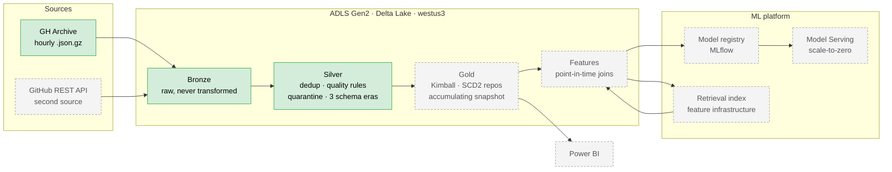

# Almanac

An **ML platform for work-queue risk**: work items arrive in a queue, some
breach their service expectation, and a model predicts which ones early
enough for a human to intervene.

Built on GitHub's public event firehose ([GH Archive](https://www.gharchive.org/))
because that dataset is real, large, free, genuinely messy, and carries a
real schema break — not because this project is about GitHub. The same
architecture serves a support-ticket queue, a claims backlog, or a fraud
review queue. The domain is incidental, and that is the point.

> **Status: Phase 0 (Exploration) complete — 9 of 9 tasks. Phase 1
> (Bronze + Silver) complete — 7 of 7, exit gate verified and merged.
> Phase 2 (Gold + the Azure burn) planned, not started.**
> **Bronze → Silver runs end to end** on both committed fixtures — era
> normalization, cross-hour dedup, null-safe quality rules and a
> conserving quarantine split — alongside the ingestion edge, local Spark
> + Delta, CI, cloud infrastructure and the declarative source contract
> (130 tests). It has also **run on a real Databricks cluster**: one day of
> the firehose, 3.79M rows, measured. **No Gold, no features, no model
> yet** — Phase 2 onward.
> Planning Phase 2 found **two defects in that committed, CI-green Phase
> 1 code** — Silver overwrote its whole table on every file, and read the
> raw archive rather than Bronze. Both are invisible at a sample size of
> one file, which is all Silver had been run against; both are the first
> task of Phase 2. Recorded rather than quietly fixed, because the
> interesting part is *why the tests passed*.
> [`docs/STATUS.md`](docs/STATUS.md) is the authoritative record, updated
> in the same commit as the work it describes.

**No number in this README is quoted unless it was measured.** Where
something is still unknown, it says so.

## The centerpiece

**Point-in-time correctness.** Every feature computed for a work item at
time T uses only events with `created_at < T`. This is where label
leakage lives — invisible in code review, impossible to bluff, and the
cleanest separator between shipped ML systems and notebook models.

## Architecture, at a glance



Solid = built and green. Dashed = designed, not built.

## What has been measured

Phase 0 existed to replace assumption with measurement. Several findings
**changed the design before code was written against the old one** —
which is the entire point of doing it first:

| Finding | Measurement | Consequence |
|---|---|---|
| **A third schema era, undocumented anywhere** | Bisected one hour per date, 2025-01 → 2026-08 | Between **2025-10-08 and 2025-10-15**, `payload.pull_request` was cut from **48 fields to 5**. Post-Oct-2025 data structurally cannot support the label. Window moved to Q3 2025; facts rebuilt from the event stream rather than embedded payloads |
| **The label was undefined for most of the population** | Full parse of one real hour (227,376 events) | Formal review reaches only **~1 PR in 4**. Redefined to *time to first human response*, later validated at **1.84× coverage** (6,533 of 6,618 PRs) |
| **Legacy events have no `id`** | 2,000 events per era | 0 of 2,000. The `event_id` dedup key the design rested on does not exist pre-2015 → content-hash surrogate |
| **Legacy timestamps are not UTC** | Same diff | Pre-2015 `created_at` carries `-07:00`. A naive parse shifts every legacy timestamp seven hours, silently, past every schema check |
| **The bot heuristic was wrong** | 1,002 distinct matching logins | **869 (86.7%) were human surnames.** Volume-ranked inspection had shown 100% true positives — structurally blind, since bots are high-volume by definition |
| **SCD2 is warranted** | 1,071,901 repos across Q3 2025 | **3,792** renames against a gate of 50. Case-only renames exist, so comparison must be case-sensitive |
| **Availability, not quota, picks the region** | `az vm list-skus --all`, 4 regions | Every Databricks node type is `NotAvailableForSubscription` in `eastus2`/`eastus`, all zones. Deployed to **`westus3`** |
| **Cluster throughput, measured not estimated** | One day (2025-08-13) on 4 × `D4ds_v6` + driver, DBR 17.3 LTS | **13.84 GB gz per *billed* cluster-hour** — 3.79M rows, $0.34/day-of-data. Timing compute and network separately mattered: the Spark-only rate is 36.72 and a single wall-clock timer would have understated the bill by a third |
| **The recorded cluster cost was 25% low** | Azure Retail Prices API, `westus3` | `num_workers: 4` provisions **five** VMs — four workers and a driver. The recorded $1.896/hr counted workers only; it is $2.370/hr |

Full write-ups in [`docs/findings/`](docs/findings/), each carrying its
method and its sample size.

**That unknown is now closed.** Cluster throughput was the last unmeasured
input, and every cost figure in the design depended on it — so Tier 3's
span was derived from a calibration run rather than chosen up front. It
came out at **13.84 GB gz per billed cluster-hour**, which made the full
Q3 2025 quarter affordable at 17.2% of the credit. The rule was written to
bind in both directions; it bound upward, from one month to a quarter.

## Stack

| Layer | Choice |
|---|---|
| Processing | PySpark 4.2.0, Delta Lake 4.4.0 |
| Cloud | Azure Databricks (Premium, Unity Catalog), ADLS Gen2, `westus3` |
| Infrastructure | Terraform |
| Language | Python 3.12 — `uv`, Pydantic v2, `ruff`, `mypy --strict`, `pytest` |
| CI | GitHub Actions — lint, format, types, tests on every push |
| Reporting | Power BI |

Stack choices, and what each substitution costs, are argued in the design
doc rather than asserted here.

## Layout

```text
src/almanac/        extract (URLs, fetching) · explore (schema, measurement) · spark
tests/              unit tests + committed fixtures; tests never touch the network
docs/design/        the authoritative architecture and phasing document
docs/findings/      measurements, each with its method and sample size
docs/plans/         per-phase implementation plans, written before any code
infra/terraform/    Azure resource group, ADLS Gen2, Databricks workspace
docker/             containerized Spark + Delta, matching CI
```

## Running it

```bash
uv sync --all-extras --dev
make check      # ruff + mypy --strict + pytest
make test-all   # includes Spark tests
make fixtures   # rebuild committed fixtures from the live archive
```

Tests run offline against committed fixtures. Anything touching the
network is marked and excluded from the default run.

## Design

[`docs/design/2026-09-01-almanac-system-design.md`](docs/design/2026-09-01-almanac-system-design.md)
is the authoritative architecture, phasing, and scope document.

## Why the name

An almanac is a book of tables indexed by date — you look up what was true
on a given day — *and* a book of forecasts. Those are the two pillars of
this system: point-in-time historical lookup, and prediction.

---

*Data: [GH Archive](https://www.gharchive.org/) by Ilya Grigorik, ODC-By v1.0.*
