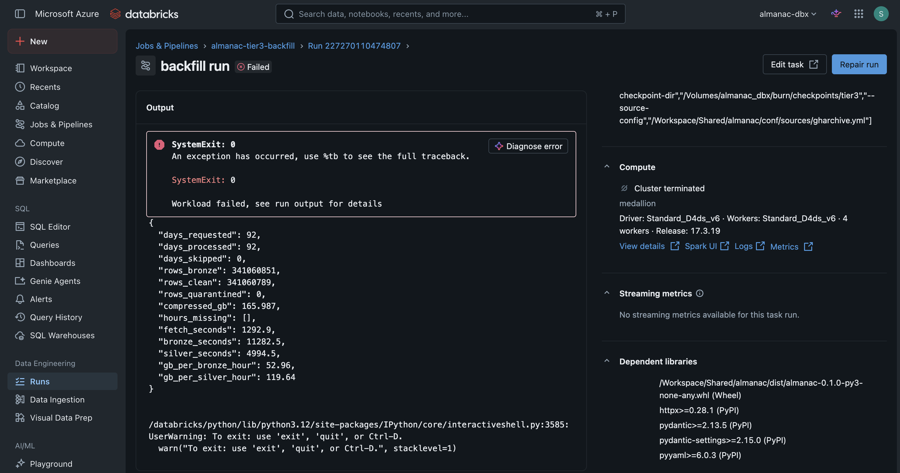
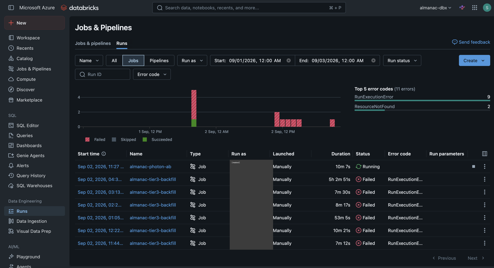
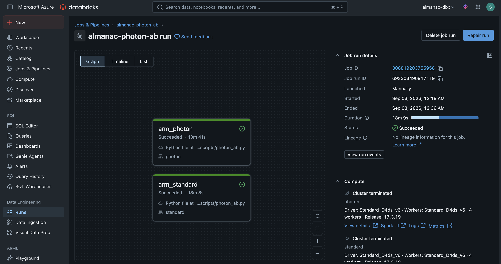
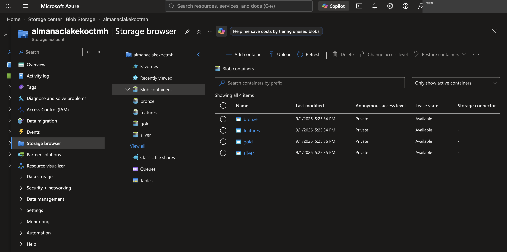
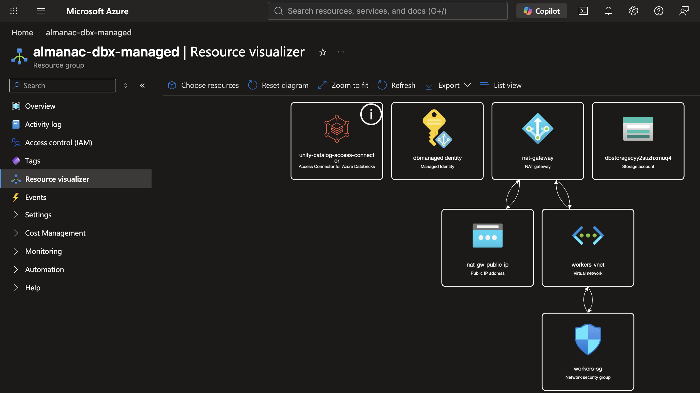
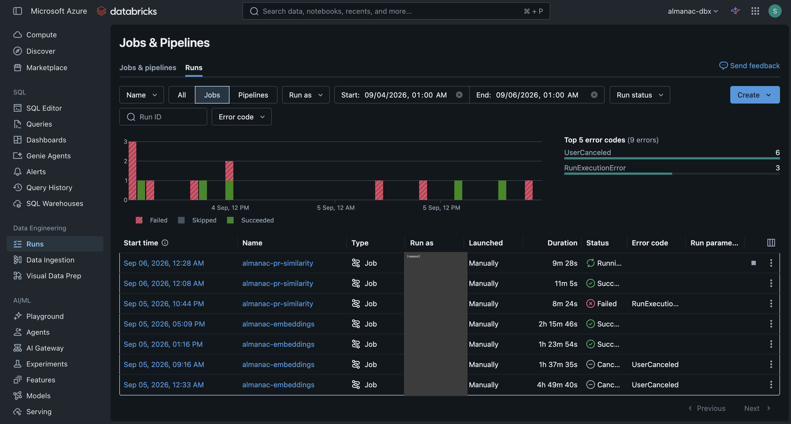
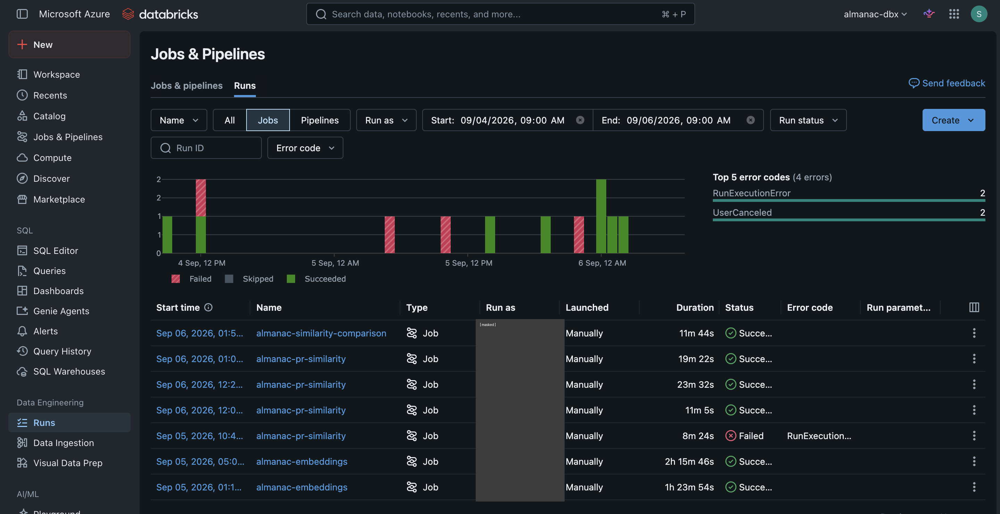

# Console evidence — what the Databricks and Azure UIs showed

**Date:** 2026-09-06
**Source:** screenshots taken during Phases 2, 4 and 5 as the work
happened, curated afterwards. Nine kept of twenty; the rest were
duplicates of the same view.
**Why this exists:** every number here is already recorded, measured, in
the findings docs and STATUS.md's verification log. This doc adds a
second, independent surface for the load-bearing ones — a reader can see
the console agreeing with the text rather than taking the text on trust.
The infrastructure behind several of these is now torn down
(`2026-09-06-vector-search-live-state-and-teardown.md`), so some of these
views no longer exist to re-capture.

**PII:** the `Run as` / `Created by` columns and one account-header strip
are masked. Nothing else identifying is in frame. Resource names
(`almanac-dbx`, the storage account) are deliberately left readable — they
are infrastructure, not people.

---

## Phase 2 — the backfill that succeeded and reported failure

The single most useful frame in this set. Run `227270110474807` shows
**`days_processed: 92` of 92, `rows_bronze: 341,060,851`,
`compressed_gb: 165.987`, `hours_missing: []`** — a complete, correct
backfill — under a header that reads **Failed**, with `SystemExit: 0` in
the output.

That is the ninth defect from
`2026-09-02-burn-deploy-and-first-run-defects.md`: `sys.exit(main())`
raises `SystemExit(0)`, and Databricks' IPython task host reads any
`SystemExit` as failure regardless of code. The screenshot makes the
contradiction visible in one frame in a way prose has to work to convey.

## Phase 2 — the six triggers before it

Six `almanac-tier3-backfill` runs, all `Failed / RunExecutionError`,
including one that burned **5h 2m 51s** before dying. STATUS.md's "the
Tier 3 backfill completed on the seventh trigger" is this, seen from the
console. Each failure had a distinct cause — DBFS-root, deploy path,
missing param, `fs.defaultFS`, storage credential, `/local_disk0`, the
`file:` URI — enumerated in the defects doc.

## Phase 2 — the Photon A/B, decided

`arm_photon` **13m 41s** against `arm_standard` **18m 8s**, both
succeeded, both on identical `Standard_D4ds_v6` × 4 workers — the whole
point of the design, since only the runtime differs. The pre-registered
hypothesis and the full result are in `2026-09-03-photon-ab.md`; this is
the run that produced it.

## Phase 2 — lineage, captured not claimed

Unity Catalog's own view of the job: **5 upstream tables read, 5
downstream written**, naming `silver.events`, `silver.events_quarantine`,
and the four gold models. Lineage is a governance claim that is cheap to
assert and awkward to prove; this is the platform asserting it, not the
repo.

## Phase 2 — the medallion, as containers

Four ADLS containers — `bronze`, `silver`, `gold`, `features` — all
`Private`. The medallion architecture as it actually exists in storage
rather than as a diagram.

## Phase 2 — the Terraform-provisioned topology

Azure's own resource graph for the managed resource group: NAT gateway
and its public IP, the workers vnet and security group, the managed
identity, the Unity Catalog access connector, and the storage account.
Useful for a reader who will not read `infra/terraform/` — the same
topology, drawn by the cloud rather than by us.

## Phase 4 — the serving endpoint, ready

`almanac-pr-review-sla-risk` **Ready**, serving
`almanac_dbx.models.pr_review_sla_risk` **Version 1** at 100% traffic on
CPU with `Small` 0-4 concurrency — i.e. scale-to-zero, which
`2026-09-06-vector-search-live-state-and-teardown.md` later confirms
from the billing side (this endpoint drew zero DBUs once its live window
closed, unlike Vector Search).

## Phase 5 — the embeddings runs, including the two that were killed

Both successful embedding runs (**2h 15m 46s** scoped, **1h 23m 54s**
proof) *and* the two `UserCanceled` ones above them — **4h 49m 40s** and
**1h 37m 35s**. Those two are the 967-partition model-reload defect and
the fork-time worker deadlock, cancelled once each was diagnosed;
`2026-09-05-embedding-partition-count-defect.md` and
`2026-09-05-embedding-worker-fork-deadlock.md` carry the analysis. The
~$15 they cost is the visible price of two real defects.

## Phase 5 — the whole task 4/6 sequence

`almanac-similarity-comparison` **11m 44s** succeeded — Task 6's real
gate — above four `almanac-pr-similarity` runs, three succeeded and one
`Failed / RunExecutionError`. That failure is the crash on a degenerate
`issue:<repo_id>` key, and the three successes are the inert run, the
scoped-but-still-inert run, and the correct one, in order. The three bugs
behind that sequence are in
`2026-09-06-similarity-real-run.md`.

---

## Not kept, and why

Eleven of the twenty were duplicates — the same Jobs-and-Pipelines run
list at slightly different times, or the Photon A/B graph mid-run rather
than finished. Where two frames showed the same thing, the one showing
the *finished* state was kept.

**Two were excluded for a different reason and deleted from
consideration entirely**: they were not Almanac at all, but a
staffing-portal timesheet page carrying a third party's full name, an
employer name, and a live `authenticationKey` in the URL. Nothing from
them is in this repo. Noted here only so the count of twenty reconciles.
