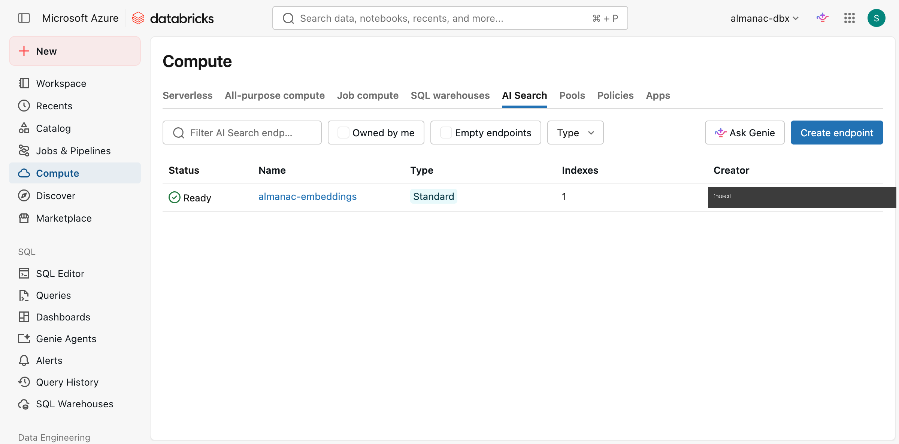
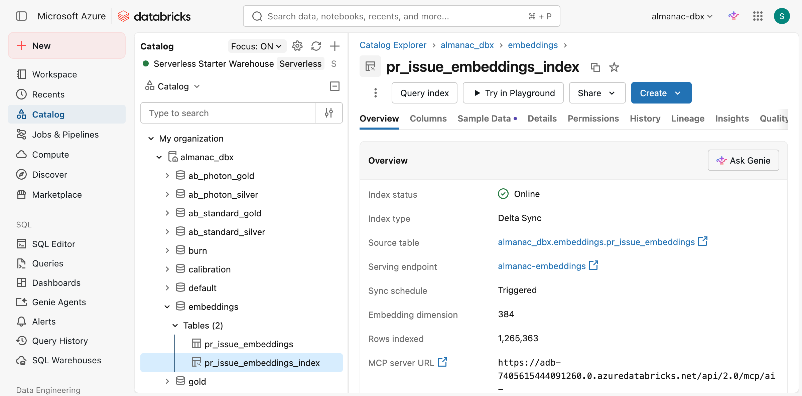

# Findings — the live Vector Search deployment, captured before teardown

**Date:** 2026-09-06
**Why this exists:** teardown is on the table for cost reasons (below).
Everything perishable about the live deployment is recorded here *first*,
so the Phase 5 claims stay checkable whether or not the infrastructure
survives — capture before the irreversible step, not after.
**Source:** `vector-search-endpoints get-endpoint`,
`vector-search-indexes get-index`, a live `similar_prs` call, and
`system.billing.usage` joined to `system.billing.list_prices`.

---

## The cost finding — Vector Search does not scale to zero

This is the transferable part, and it was not obvious from the docs.

Hourly DBU draw for `almanac-embeddings`, attributed through
`usage_metadata.endpoint_name`:

| hour (UTC) | DBU | what was happening |
|---|---|---|
| 09-05 21:00 | 2.329 | endpoint coming online |
| 09-05 22:00 | 4.000 | idle |
| 09-06 00:00–07:00 | 4.000 each | **~12,400 real queries ran in this window** |

**Flat 4.000 DBU/hour, every hour, whether it served 12,400 queries or
none.** A `STANDARD` Vector Search endpoint bills for existing, not for
use.

The contrast is the point. The Phase 4 model-serving endpoint,
`almanac-pr-review-sla-risk`, is on the *same* billing SKU
(`PREMIUM_SERVERLESS_REAL_TIME_INFERENCE_US_WEST_3`) and drew DBUs only
during its 2026-09-04 17:00–19:00 live window, then **zero**. Scale-to-zero
works there and does not exist here — so "it's serverless" is not a
statement about idle cost, and the two have to be reasoned about
separately.

At the measured rate: **96 DBU/day ≈ $6.72/day ≈ $202/month idle**.
Against the $184 credit expiring 2026-09-24, leaving it standing to the
expiry would have cost ~$121 — most of what remained after Phase 5's
$65.75 of measured Databricks spend — for a service nothing was querying.

Design doc §9 puts the next use of this index in Phase 7's bounded demo
window (Nov 9–22), ~64 idle days away, ≈$430. Phase 6 (streaming) needs
the online store, not this. So it comes down.

**Re-check on the query cost:** the ~135 ms/query figure recorded in
`2026-09-06-similarity-real-run.md` is a *latency*, not a price. There is
no measurable per-query charge — the 4.000 DBU/hour is the entire cost,
which is why a bounded, heavily-used window is the efficient way to use
this service and a long idle one is the worst.

## Endpoint, as deployed



The Creator column is masked; every other identifying field in these two
captures is an infrastructure name, not a person.

```
name                 almanac-embeddings
id                   9ea6c036-ee06-47ab-a184-3abdf059dd94
endpoint_type        STANDARD
endpoint_status      ONLINE
num_indexes          1
creation_timestamp   1788614302839  (2026-09-05)
```

## Index, as deployed



```
name                 almanac_dbx.embeddings.pr_issue_embeddings_index
index_type           DELTA_SYNC
index_subtype        HYBRID          (server-assigned, not requested)
pipeline_type        TRIGGERED
pipeline_id          c6cc9c29-d9c9-4aea-aaeb-6481d86760fa
source_table         almanac_dbx.embeddings.pr_issue_embeddings
primary_key          entity_key
embedding column     embedding, dimension 384
indexed_row_count    1265363
status.ready         true
```

`indexed_row_count` is 1,265,363 against a 1,859,551-row source because
the index deduplicates on `entity_key` — 1,141,458 distinct `pr:` keys
plus 123,905 collapsed `issue:` keys. See
`2026-09-06-similarity-real-run.md` bug 1 for why the issue keys
collapsed.

## Live query, captured 2026-09-06T13:04:23Z

Run through `almanac.embed.query.similar_prs` — §6's contract — against
the live endpoint, k=5. Byte-identical to the same query run ~10 hours
earlier, so the index is deterministic across the window:

```
query: repo_id=998922291 pr_number=1476 as_of=2025-09-29T11:17:14+00:00
  pr:998922291:1475   2025-09-29T10:56:18  score=0.6376
  pr:1024190983:405   2025-09-23T22:30:25  score=0.5617
  pr:998922291:1454   2025-09-27T21:03:18  score=0.5613
  pr:1060870165:5     2025-09-21T23:41:48  score=0.5608
  pr:970331732:2787   2025-09-02T09:26:55  score=0.5578
  all_older_than_as_of: True

query: repo_id=520252357 pr_number=2858 as_of=2025-09-29T14:30:53+00:00
  pr:337517113:4150   2025-09-25T18:43:51  score=0.9984
  pr:654032037:306    2025-09-25T20:42:39  score=0.9984
  pr:752241307:438    2025-09-25T21:29:06  score=0.9793
  pr:660746735:1011   2025-09-25T21:03:19  score=0.9566
  pr:469086412:387    2025-09-27T21:36:23  score=0.9501
  all_older_than_as_of: True
```

The first query's top hit is the immediately preceding PR in the same
repo, opened 21 minutes earlier, with a third hit also from that repo.
The second query's ≥0.99 scores are near-duplicate text — what templated
bot PRs look like to an embedding model.

## What teardown does and does not destroy

**Destroyed:** the endpoint and the index's synced ANN copy. Both are
Terraform resources in `infra/terraform/vector_search.tf`.

**Kept:** `almanac_dbx.embeddings.pr_issue_embeddings` — 1,859,551 rows
of real embeddings on ADLS, the expensive artifact (≈$24 of CPU encode
across a proof run and a scoped run). Also kept: the two MLflow
experiments carrying Task 6's with/without metrics, the registered
champion, `system.billing` history, and the storage account holding the
341M-row quarter.

So this is **not** a re-embed. Recreation is `terraform apply` plus one
index sync.

## Recreate

```sh
export DATABRICKS_HOST=https://adb-7405615444091260.0.azuredatabricks.net
cd infra/terraform
terraform apply -target=databricks_vector_search_endpoint.embeddings
terraform apply -target=databricks_vector_search_index.pr_issue_embeddings
databricks vector-search-indexes sync-index \
  --index-name almanac_dbx.embeddings.pr_issue_embeddings_index
# wait for get-index ... status.ready = true, then re-run the query above
```

**Note before destroying:** `vector_search.tf` carries
`prevent_destroy = true` on the index, added 2026-09-05 because the
provider reads `endpoint_id`/`index_subtype` as drifting to null and a
plain `apply` would otherwise destroy and recreate it. That guard has to
be removed deliberately for a teardown, and **restored afterwards** — it
is protecting against a different failure than this teardown is.
