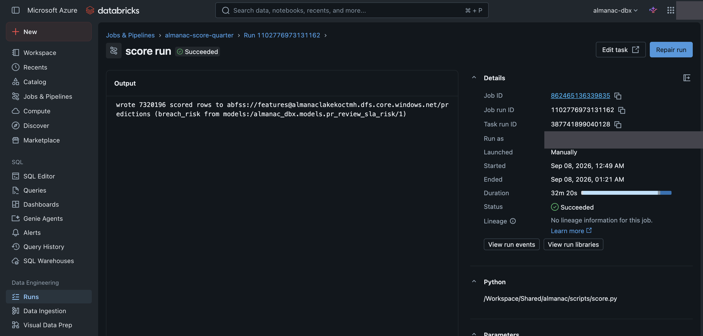
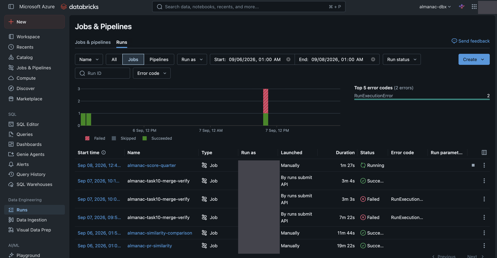
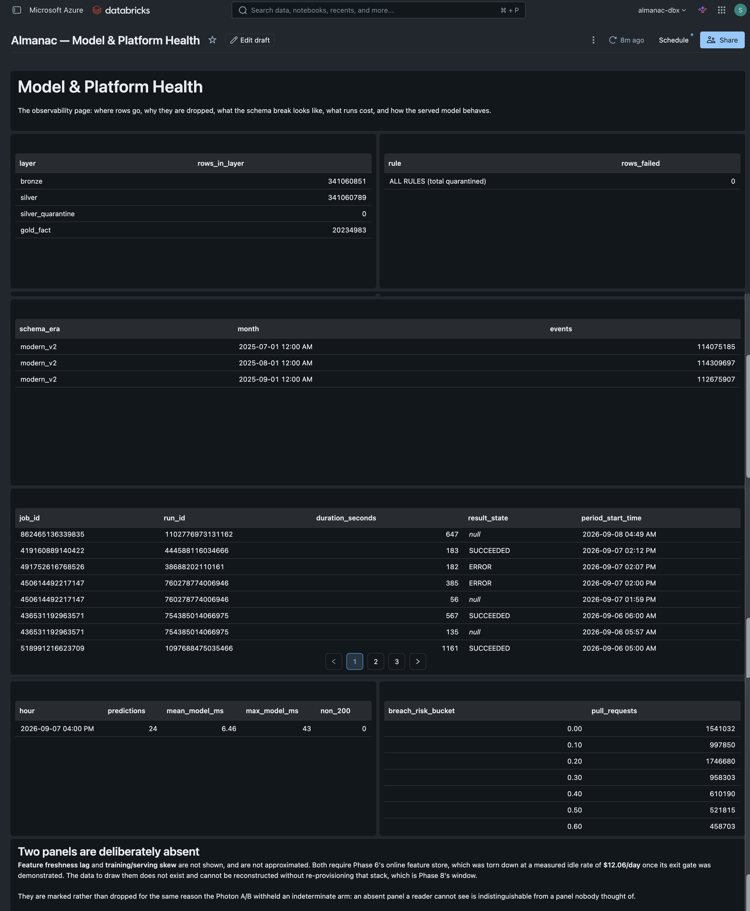
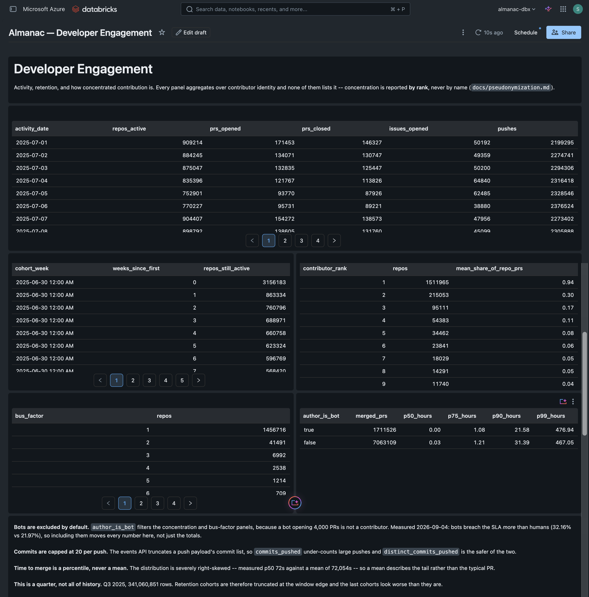

# The reporting window — what ran, what broke, what it cost

**Date:** 2026-09-08
**Scope:** Phase 7 Task 10, the only billable step in the phase. Batch
scoring job, then a serverless SQL warehouse and three AI/BI dashboards
against real Gold, then teardown.
**Rule followed:** capture before the irreversible step. Every identifier
and number below was recorded while the window was open.

---

## Identifiers, captured before teardown

| Thing | Value |
|---|---|
| Workspace | `adb-7405615444091260.0.azuredatabricks.net` |
| Metastore | `8be4b9b0-d268-47b2-94cd-8fd6e97f9055` |
| Warehouse | `afb36db24412bba2` — `almanac-reporting`, 2X-Small, PRO, serverless, `auto_stop_mins = 5` |
| Dashboard: Review SLA Risk | `01f1ab45df741775b86af6572697afe4` |
| Dashboard: Model & Platform Health | `01f1ab45df7514b798d2d9c666572787` |
| Dashboard: Developer Engagement | `01f1ab45df751ad28ae2a75b9eda7755` |
| Scoring job / run | `862465136339835` / `1102776973131162` |
| Scoring cluster | `0908-044913-us1wbbpc` |

Phase 6 nearly lost a workspace id to teardown; this table is that lesson
applied rather than restated.

---

## Pre-flight, before anything billed

Four checks, all free, all against the live workspace:

| Risk | Check | Result |
|---|---|---|
| Dashboard SQL names a table that does not exist | `databricks tables list` | **Four dead references found** — see below |
| Predictions columns disagree with the contract | contract vs. committed SQL | exact match on all five |
| `system.lakeflow` not enabled | `system-schemas list` | `MANAGED` |
| Serverless cannot read `abfss://` Bronze | `external-locations list` | `almanac-lake-bronze` covers it |

**The four dead references, fixed in `2c8d2bd` before the window opened:**
`silver.events_clean` (twice — the table is `silver.events`),
`bronze.events` (there is no `bronze` *schema*; Bronze is an ADLS path),
and `features.pr_breach_predictions` before the scoring job had
registered it. `terraform plan` proves the resources exist and **never
opens the JSON**, and a Lakeview dashboard querying a missing table
renders an error panel rather than failing loudly — so the first signal
would have been a broken page inside the paid window. Now guarded by
`KNOWN_OBJECTS` in `tests/unit/test_reporting_dashboards.py`.

---

## The scoring run

Run `1102776973131162`, SUCCESS, **7,320,196 rows** written to
`abfss://features@…/predictions` and registered as
`almanac_dbx.features.pr_breach_predictions` (EXTERNAL DELTA).

| Phase | Duration |
|---|---|
| `setup_duration` | **1,642 s (27.4 min)** |
| `execution_duration` | **298 s (5.0 min)** |
| `run_duration` | 1,941 s (32.3 min) |



The console saying the same thing the numbers above say: **`wrote 7320196
scored rows`**, from `models:/almanac_dbx.models.pr_review_sla_risk/1`,
`32m 20s`, `Succeeded`. The `Run as` field and the account avatar are
masked; the job, run and task ids are deliberately readable, because they
are infrastructure rather than people.



The same job mid-flight, above Phase 7 Task 4's three
`almanac-task10-merge-verify` runs — two `Failed`, then one `Succeeded`.
That is the contract-enforcement task proving a breach fails the build
before the fix landed, which is the shape every task here is supposed to
have.

**Provisioning was 3.5× the work.** This project's recorded provisions are
441 s and 471 s; this one took 1,642 s, spending ~25 minutes in
`Finding instances for new nodes` before reaching `Setting up 5 nodes`.
No capacity error was raised and the run then succeeded normally, so this
is recorded as an observed Azure allocation latency for 5 ×
`Standard_D4ds_v6`, **n = 1**, not as a general claim about the region.

It also isolates a billing distinction worth stating precisely: Azure VM
charges begin when instances start being allocated, while Databricks DBUs
begin when the Spark context becomes available. For 27 of this run's 32
minutes only one of the two meters was running.

---

## Every dashboard panel, executed

All 15 committed dataset queries were run directly against the warehouse
rather than eyeballed in the UI — the Lakeview widget schema is not
publicly documented, so "the JSON was accepted" is not evidence that a
panel returns rows.

**First pass: 14/15.** `ds_calibration` failed:

```
[MISSING_AGGREGATION] The non-aggregating expression "breach_risk" is
based on columns which are not participating in the GROUP BY clause.
```

`ntile(10) OVER (...)` is a window function, evaluated *after* `GROUP BY`,
so grouping by its own alias is invalid. Rewritten to compute the decile
in a subquery. **Second pass: 15/15.** The fixed JSON was redeployed
(`0 added, 1 changed, 0 destroyed`) and the published dashboard verified
through the Lakeview API to carry the corrected query.

This was the calibration panel — the single most load-bearing ML-quality
panel in the project — and it was broken in committed, test-passing,
`terraform`-applied config. The offline suite checks that every widget
names a declared dataset and that every queried object exists; it cannot
check that the SQL *parses on Databricks*. Only running it does.

---

## Every panel then failed to *render*, which is a different check

15/15 datasets executing proves the **data** layer. It says nothing about
the **render** layer, and the render layer was entirely broken:

> The imported widget definition was invalid so it changed to the default.
> Here are the details: spec must have required property `allowHTMLByDefault`

Every data widget across all three pages fell back to a default bar chart.
Text panels were fine. The committed spec was
`{"version": 1, "widgetType": "table"}`.

**The error message points at the wrong fix.** `allowHTMLByDefault`
belongs to the **v1** schema. The shape Lakeview actually accepts is
**v2**, where that property does not exist at all:

```json
"spec": {
  "version": 2,
  "widgetType": "table",
  "encodings": { "columns": [ { "fieldName": "repo_id" } ] },
  "data": { "queryName": "main_query" }
}
```

`queries[0].name` must equal `spec.data.queryName`; the UI uses
`main_query`. This was **read back from the workspace** after letting the
editor rebuild one widget — the Lakeview widget schema is not in the
Databricks docs, the CRUD tutorial's `serialized_dashboard` examples are
minimal, and the REST API accepts invalid specs without complaint.
Guessing from the error text would have produced a v1 spec with one more
property and failed again.

Fixed across all 15 data widgets, redeployed, and pinned by
`test_every_data_widget_carries_a_renderable_spec`, mutation-tested three
ways (downgrade to v1, drop an encoding column, break the `queryName`
link — each fails the test).

## Terraform does not own a dashboard exclusively

**An open browser editor silently reverted deployed config.** Sequence,
from the API's own timestamps:

| Time (UTC) | Event |
|---|---|
| 05:43:54 | `terraform apply` writes correct v2 table specs, publishes |
| 06:00:27 | draft rewritten to `{"version": 3, "widgetType": "bar", …}` |
| 06:19:08 | draft rewritten again |

Nobody edited deliberately. A tab left open from **before** the fix held
stale widget state in memory and flushed it to the server, overwriting
Terraform's write. The clobbering hit the **draft** only — the published
revision stayed at 05:43:54, which is why the screenshots below are
correct — and `terraform apply` reported success both times, because the
conflict happens after the apply, not during it.

This is a genuine hazard for managing AI/BI dashboards as code: the apply
takes no lock, the editor is a second writer, and last write wins. Close
the editors before applying, and verify the draft afterwards rather than
trusting the apply's exit code.

## A correct panel that read as a broken one

`ds_quarantine_by_rule` rendered **"No data"**. The query was right and
the data was right: it groups by *failing rule*, and with **0 of
341,060,851** events ever quarantined
(`2026-09-02-zero-quarantined.md`) there are no groups to emit.

But "No data" is indistinguishable from a failed query, so the most
reassuring number in the pipeline was presenting as a suspected bug. The
query now unions an explicit total, so it always emits at least one row
and *states* the zero:

```
rule                            rows_failed
ALL RULES (total quarantined)             0
```

The empty case needed designing, not just the populated one.

---

## The pages, as rendered






Captured from the **published** view and stitched from scrolled captures.
Page 2 shows this session's own scoring run (job `862465136339835`, run
`1102776973131162`) in its job-runs panel, and Task 1's inference capture
as 24 predictions at a mean of 6.46 ms, max 43 ms, zero non-200s.

**A defect visible in that panel, recorded not fixed:** `ds_job_runs`
renders `result_state` as `null` for several runs including this one,
because `system.lakeflow.job_run_timeline` emits one row per *period* and
a multi-period run has no terminal state on every row. A reader would
reasonably misread `null` as "failed to record". The panel needs to
aggregate per `run_id`; it currently does not.

---

## Measured results

### Model calibration, deciles of predicted risk

| Decile | Mean predicted | Observed rate | PRs |
|---|---|---|---|
| 1 | 0.0018 | 0.0006 | 732,020 |
| 2 | 0.0056 | 0.0028 | 732,020 |
| 3 | 0.0867 | 0.0612 | 732,020 |
| 4 | 0.1503 | 0.1300 | 732,020 |
| 5 | 0.1920 | 0.1818 | 732,020 |
| 6 | 0.2341 | 0.2353 | 732,020 |
| 7 | 0.2921 | 0.3082 | 732,019 |
| 8 | 0.3888 | 0.3967 | 732,019 |
| 9 | 0.5205 | 0.5225 | 732,019 |
| 10 | 0.6837 | 0.7155 | 732,019 |

Monotonic across all ten deciles, with predicted tracking observed
closely. The model is slightly **over**-confident in deciles 3–4 and
slightly **under**-confident in decile 10.

### Segment calibration reproduces §5.3 independently

| Segment | PRs | Mean predicted | Observed breach rate |
|---|---|---|---|
| Bot author | 2,569,376 | 0.3206 | **0.3216** |
| Human author | 4,750,820 | 0.2204 | **0.2197** |

§5.3 measured the breach rate on 2026-09-04 by direct SQL as **32.16%
for bots and 21.97% for humans**. Those figures are reproduced here to
the basis point, from a different table, by a different route.

### The medallion funnel

| Layer | Rows |
|---|---|
| Bronze | 341,060,851 |
| Silver | 341,060,789 |
| Silver quarantine | **0** |
| `gold.fact_pull_request` | 20,234,983 |

Bronze minus Silver is **62** — exactly the adjacent-hour duplicate count
measured in Phase 2 (62 in 341,060,851). Deduplication is visible as a
single arithmetic difference between two independently counted layers.
Quarantine at zero matches `2026-09-02-zero-quarantined.md`.

### Time to merge

| Author | Merged PRs | p50 (h) | p90 (h) |
|---|---|---|---|
| Bot | 1,711,526 | 0.00 | 21.58 |
| Human | 7,063,109 | 0.03 | 31.39 |

---

## The defect this window found

The `+75` row discrepancy between the scored table and §5.3's population
is a real fan-out in the feature spine: 25 PRs have two distinct
`opened` events in the firehose, and both `build_pr_opened_spine` and
`compute_pr_static` emit one row per *event* rather than per PR, so their
equi-join multiplies them to four. Full analysis, including why Silver's
`event_id` deduplication is correct to keep both events, in
`2026-09-08-pr-opened-spine-fanout.md`.

---

## Teardown

`make window-down` at **06:53:46 UTC**, removing all four addresses:
the warehouse and the three dashboards.

Terraform's own exit is not the evidence. `window.survivors()` re-read
state after the destroy and confirmed absence, and four independent
checks were run afterwards:

| Check | Result |
|---|---|
| `terraform state list \| grep reporting` | no reporting resources |
| `databricks warehouses list` | only the pre-existing Starter warehouse, `STOPPED` |
| `/api/2.0/lakeview/dashboards` | none |
| `databricks clusters list` | none running |

One thing the destroy output shows that is *not* a survivor: it still
printed `dashboard_urls` with all three ids. That is stale output
rendering, and it is exactly the trap `window.workspace_url` exists for —
`terraform output` is not a reliable statement about what exists. The
four checks above are.

The window was open from **05:26 UTC** (first `window-up`) to **06:53
UTC**, about 87 minutes, longer than planned because the widget-schema
defect had to be found, fixed and re-verified inside it. The warehouse is
2X-Small serverless with `auto_stop_mins = 5` and was idle for much of
that.

## Cost

*(pending — `system.billing.usage` lags roughly a day and cannot be
queried for the window it is measuring, the constraint recorded in Phase
6. To be filled in from the billing tables, not estimated.)*
