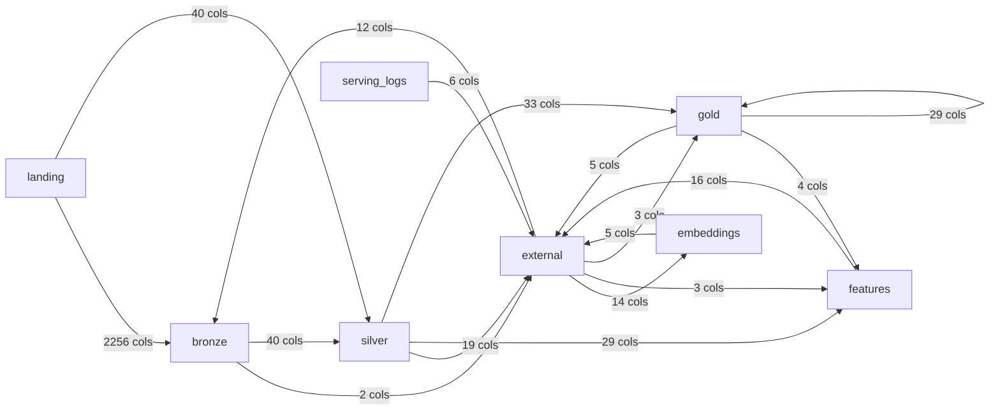

# Column lineage — generated, not asserted

**Generated:** 2026-09-07 17:49 UTC by `make lineage`  
**Source:** `system.access.column_lineage` (Unity Catalog's own record)  
**Scope:** the production medallion — external, landing, bronze, silver, gold, features, embeddings, models, serving_logs

Regenerate with `make lineage`. Nothing here is hand-written; if a tier is missing from the graph below, the pipeline stopped producing it, or the extraction broke. `tests/unit/test_governance_lineage_artifact.py` fails on either.

## The graph

**2516 distinct column-to-column edges** across 17 tier hops.

| From | To | Column edges | Source tables | Target tables |
|---|---|---|---|---|
| `bronze` | `external` | 2 | 1 | 1 |
| `bronze` | `silver` | 40 | 1 | 2 |
| `embeddings` | `external` | 5 | 2 | 1 |
| `external` | `bronze` | 12 | 1 | 3 |
| `external` | `embeddings` | 14 | 1 | 2 |
| `external` | `features` | 3 | 1 | 1 |
| `external` | `gold` | 3 | 1 | 1 |
| `features` | `external` | 16 | 4 | 1 |
| `gold` | `external` | 5 | 1 | 1 |
| `gold` | `features` | 4 | 1 | 1 |
| `gold` | `gold` | 29 | 3 | 3 |
| `landing` | `bronze` | 2256 | 2256 | 3 |
| `landing` | `silver` | 40 | 1 | 2 |
| `serving_logs` | `external` | 6 | 1 | 1 |
| `silver` | `external` | 19 | 1 | 1 |
| `silver` | `features` | 29 | 1 | 4 |
| `silver` | `gold` | 33 | 1 | 4 |

## What this cannot see

1. Local Spark runs are invisible. Unity Catalog records lineage for work executed on Databricks; this repo's entire test suite runs on local Spark and contributes nothing here. An edge's absence is not evidence it does not exist in code.
2. The lineage system tables keep a rolling 1-year window. Catalog Explorer and the lineage API retain indefinitely for lineage captured after 2024-09-01, so this artifact is the cheap view, not the archival one.
3. Lineage is emitted only where it can be inferred: a column written from a literal, rather than read from somewhere, produces no edge at all.
4. Phase 2's Photon A/B schemas (ab_photon_*, ab_standard_*) are excluded on purpose. They are a one-off experiment harness, and including them would present four extra tiers as though they were part of the platform.
5. `external` is a residual bucket, not a place. It holds anything not in this catalog, not in a lake container, and not under a volume -- staging paths and foreign tables alike. An `x -> external` edge says only that something was written somewhere this taxonomy does not name; do not read it as an export.

Stated here rather than in a separate document because a lineage graph is read as complete unless it says otherwise, and this one is not.
